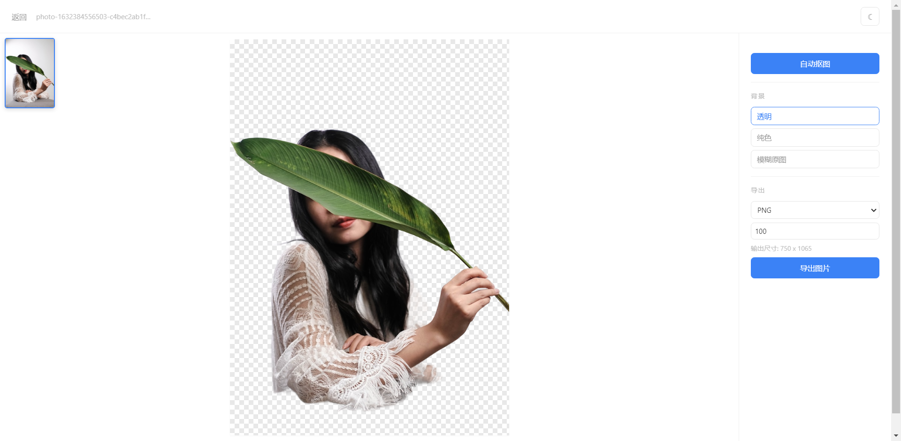

# 在线抠图

基于 AI 的在线图片背景移除工具，纯浏览器端处理，无需上传图片至任何服务器。

## 功能特性

- **AI 智能抠图**：使用 IS-Net 深度学习模型自动识别并移除图片背景
- **纯本地处理**：所有计算均在浏览器中完成，图片不会离开你的设备
- **多种导入方式**：支持拖拽、点击选择、粘贴图片
- **三种背景模式**：
  - 透明背景 — 保留 PNG 透明通道
  - 纯色背景 — 自定义纯色填充，支持预设色板和取色器
  - 模糊原图 — 以原图模糊效果作为背景
- **多格式导出**：支持 PNG、JPG、WebP 三种格式
- **缩放与平移**：鼠标滚轮缩放、拖拽平移，支持触摸手势
- **导出尺寸控制**：支持 10% - 400% 的自定义导出缩放比例
- **深色模式**：自动跟随系统主题，也支持手动切换
- **响应式布局**：适配桌面端和移动端
- **PWA 支持**：可安装到桌面，具备独立应用体验

## 技术栈

| 类别 | 技术 |
|------|------|
| 语言 | TypeScript |
| 构建工具 | Vite 6 |
| AI 模型 | @imgly/background-removal (IS-Net) |
| 样式 | 原生 CSS（CSS 变量 + 深色模式） |

## 快速开始

```bash
# 进入项目目录
cd image-matting

# 安装依赖
npm install

# 启动开发服务器
npm run dev

# 构建生产版本
npm run build
```

首次使用时，浏览器会自动下载AI模型文件（约176MB），下载完成后会缓存到本地，后续使用无需重新下载。

## 项目结构

```
image-matting/
├── index.html              # 入口 HTML
├── public/
│   ├── manifest.json       # PWA 配置
│   └── icon.svg            # 应用图标
├── src/
│   ├── main.ts             # 应用入口
│   ├── state.ts            # 状态管理
│   ├── types.ts            # 类型定义
│   ├── ui.ts               # UI 交互逻辑
│   ├── engine.ts           # 抠图引擎（封装 AI 模型调用）
│   ├── composite.ts        # 画布合成（前景 + 背景混合）
│   ├── export.ts           # 图片导出
│   └── style.css           # 全局样式
├── package.json
├── tsconfig.json
└── vite.config.ts
```

## 浏览器兼容性

项目使用了 `SharedArrayBuffer` 以提升 AI 模型推理性能，部署时需要服务器配置以下 HTTP 响应头：

```
Cross-Origin-Opener-Policy: same-origin
Cross-Origin-Embedder-Policy: credentialless
```

开发服务器（`npm run dev`）已自动配置这些头部。

## 截图


